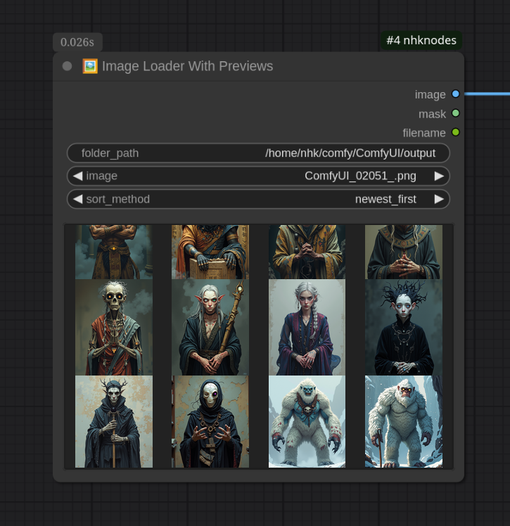
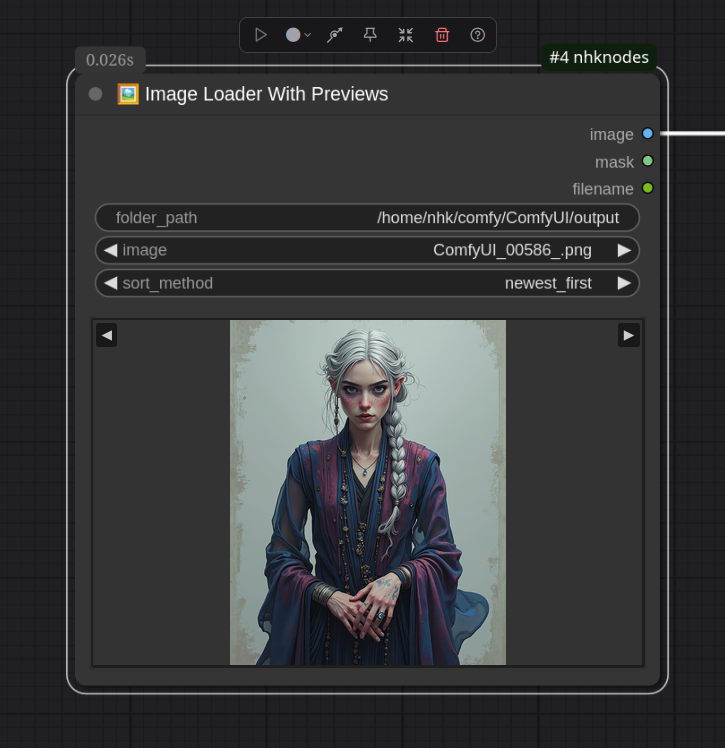

# NHK Nodes for ComfyUI

A comprehensive collection of utility nodes for ComfyUI workflows. Organized into logical categories for better workflow management.

## 🌟 Featured Node

### 🖼️ Image Loader With Previews
The standout feature of this collection - an advanced image loader that hopefully simplifies how you browse and select images in ComfyUI.

<p align="center">
  
  
</p>

- **Browse any folder** on your system, not just ComfyUI's input folder
- **Live image previews** - see images before selecting
- **Multiple sorting options**: name, date modified, created


## 📦 Installation

### Via ComfyUI Manager (Recommended)
1. Open ComfyUI Manager
2. Search for "NHK Nodes"
3. Click Install
4. Restart ComfyUI

### Manual Installation
1. Clone or download this repository to `ComfyUI/custom_nodes/nhknodes`
2. Restart ComfyUI
3. Nodes will appear in organized categories under `nhk`

## 🗂️ Other cool nodes

### 🔤 Text Processing (`nhk/text`)
- **📝 Simple Text Input** - Clean text input with pass-through output
- **📄 Text Display** - View text content in the UI while passing it through
- **📝 Text Combiner** - Merge unlimited text inputs with dynamic connections and custom separator
- **📝 Text Template** - Template engine with placeholder replacement (e.g., "The [text_1] walks in the [text_2]")

### 🖼️ Image Processing (`nhk/image`)
- **🖼️ Image Loader With Previews** - Advanced image loading with folder browsing ⭐
- **📦 Image Grid Batch** - Combine unlimited images into batch tensors
- **🎯 Image Grid Composite** - Create visual grids with configurable spacing and backgrounds

### ⚙️ Workflow Utilities (`nhk/utility`)
- **🔄 Cycling Switch** - Automatically cycle through unlimited inputs
- **🔀 Double Switch** - A/B switch with pairs of inputs (ex: img and text pairs)
- **⏱️ Execution Counter** - Count executions and auto-stop queues, used to circumvent Comfy 100 runs limit.
- **📐 Size Picker** - Model-optimized presets for Flux, SDXL, and Qwen
- **📍 Set Node** - Create variable tunnels for cleaner graphs
- **📤 Get Node** - Retrieve values from Set nodes

### 🤖 AI & Machine Learning (`nhk/ai`)
- **👁️ Qwen Vision** - Analyze images with Ollama's Qwen2.5VL vision model
- **🤖 OpenAI API** - Chat with OpenAI GPT-4/GPT-5 models with vision support (requires API key)

## 🚀 Key Features

- **Dynamic Inputs** - Many nodes support unlimited inputs that auto-expand as you connect
- **Smart UI** - Hover tooltips and emoji icons for easy identification
- **Clean Organization** - Logical categories make nodes easy to find
- **Professional Quality** - Consistent design and error handling throughout

## 📋 Requirements

### For OpenAI API Node
- OpenAI API key in `.env` file:
  ```
  OPENAI_API_KEY=your_api_key_here
  ```
- Supports GPT-4 (gpt-4o, gpt-4o-mini, chatgpt-4o-latest) and GPT-5 (gpt-5, gpt-5-mini, gpt-5-nano) models
- Vision capabilities for image analysis with all models

### For Qwen Vision Node  
- Ollama installed and running
- Qwen2.5VL model pulled in Ollama

## 🔧 Development

This collection follows strict coding standards:
- Consistent documentation headers
- Emoji prefixes for all nodes
- Hover tooltips via `DESCRIPTION` attributes
- Organized category structure

See `CLAUDE.md` for detailed development guidelines.

## 📄 License

MIT License - Feel free to use, modify, and distribute.

## 🤝 Contributing

Contributions welcome! Please follow the existing code style and add appropriate documentation.

---

**Created by NHK** | [GitHub](https://github.com/Enashka/ComfyUI-nhknodes) | [ComfyUI Registry](https://registry.comfy.org/)